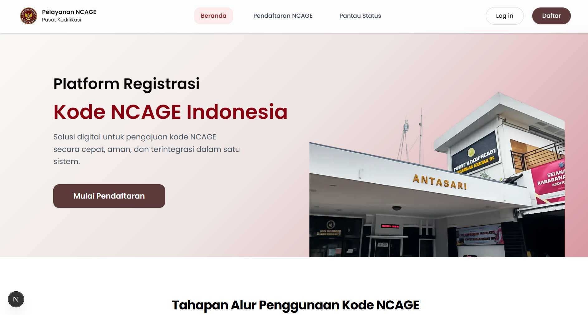
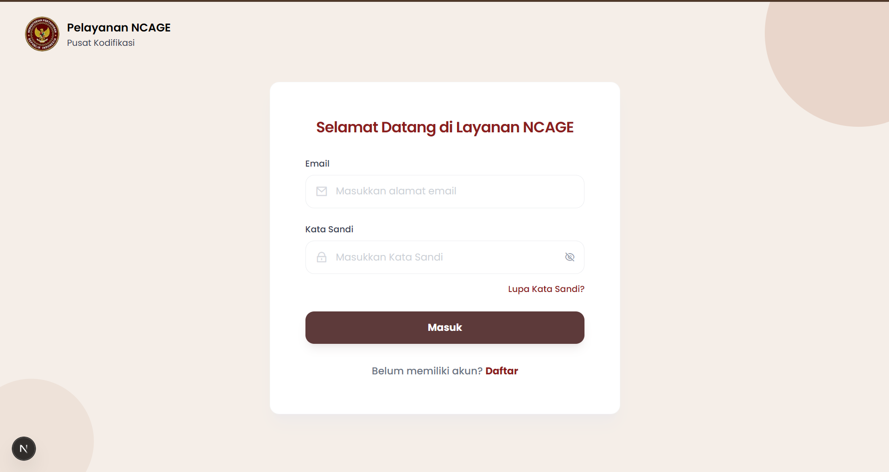
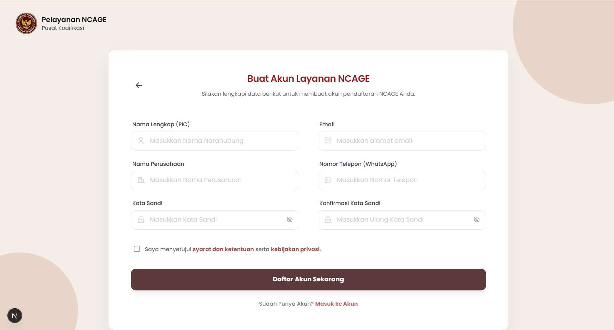
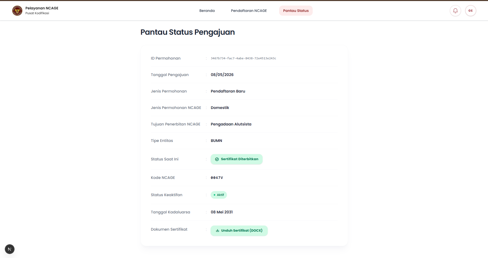
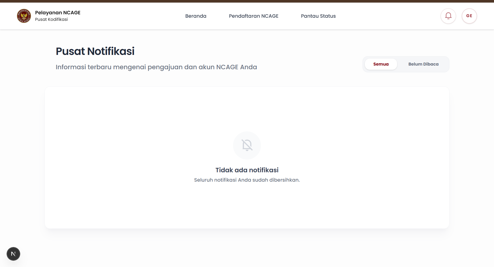
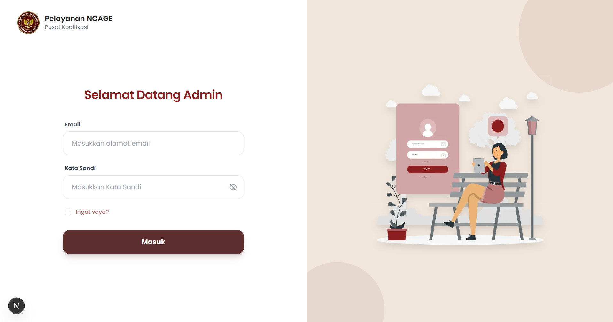
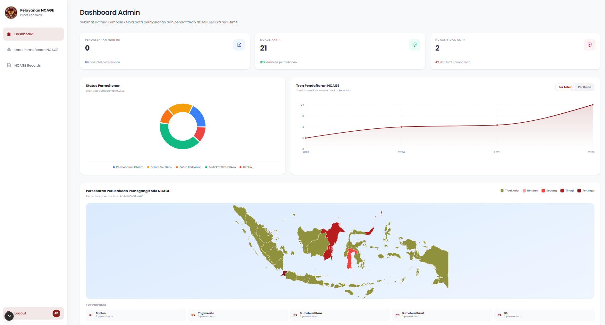
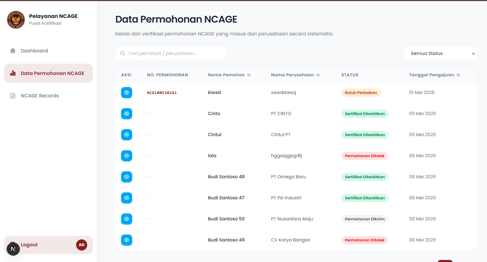
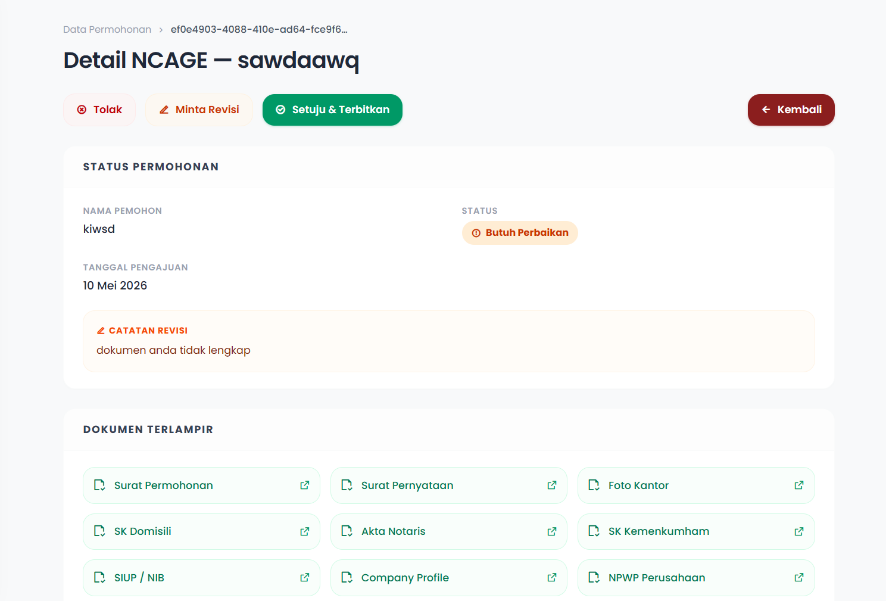

# NCAGE Indonesia — Platform Pelayanan Kode NCAGE

**Platform digital resmi untuk pendaftaran, verifikasi, dan pemantauan status kode NCAGE (_NATO Codification for Ammunition, General Equipment and Explosives_) Indonesia** yang dikelola oleh Pusat Kodifikasi (_Puskod_) Kementerian Pertahanan RI.

Sistem ini menyediakan dua portal utama: **portal perusahaan** untuk pelaku industri pertahanan yang ingin mendaftarkan kode NCAGE dan memantau status pengajuan, serta **portal admin** bagi petugas Puskod Kemhan untuk memverifikasi, menyetujui, merevisi, atau menolak permohonan serta mengelola penerbitan sertifikat NCAGE.

Aplikasi dibangun dengan **Next.js 16 App Router**, **TypeScript**, **Tailwind CSS v4**, dan **Supabase** sebagai _backend-as-a-service_ (autentikasi, database PostgreSQL, dan penyimpanan dokumen). Seluruh logika server-side menggunakan **React Server Components** dan **Server Actions** — tanpa REST API endpoints.

---

## Fitur Utama

### Portal Perusahaan
- **Registrasi & Autentikasi** — Pendaftaran akun perusahaan, login email/password, lupa/reset password via OTP
- **Pendaftaran NCAGE Multi-Step** — Wizard 3 tahap: unggah 11 dokumen persyaratan, isi formulir data (identitas entitas, kontak pemohon, detail badan usaha, informasi lainnya), dan review sebelum kirim
- **Pantau Status** — Pelacakan status permohonan secara real-time dengan 5 tahapan: Dikirim → Verifikasi → Revisi → Diterbitkan / Ditolak
- **Download Sertifikat** — Unduh sertifikat NCAGE dalam format `.docx` yang di-generate otomatis saat permohonan disetujui
- **Notifikasi** — Inbox notifikasi real-time (peringatan, sukses, info, keamanan) dengan filter sudah/belum dibaca
- **Profil Akun** — Edit data perusahaan, foto profil, dan ganti password
- **Perpanjangan NCAGE** — Deteksi otomatis H-30 kadaluarsa kode NCAGE dan fasilitasi pengiriman ulang dokumen perpanjangan

### Portal Admin
- **Dashboard Analytics** — Statistik pendaftaran hari ini, jumlah NCAGE aktif/non-aktif, distribusi status permohonan (pie chart), tren pendaftaran tahunan/bulanan (area chart), peta persebaran perusahaan per provinsi
- **Manajemen Data Permohonan** — Tabel seluruh permohonan dengan filter, pencarian, sorting, dan pagination; detail permohonan lengkap dengan preview dokumen via signed URL
- **Verifikasi Permohonan** — Aksi admin: setujui (terbitkan sertifikat `.docx` + kode NCAGE), minta revisi (dengan catatan), atau tolak
- **Manajemen NCAGE Records** — Tabel seluruh kode NCAGE yang diterbitkan dengan status aktif/non-aktif, tanggal terbit & kadaluarsa, dan sertifikat; detail record per kode NCAGE
- **CSV Export** — Export data tabel ke file CSV

---

## Instalasi & Menjalankan Proyek

### Prasyarat
- **Node.js** minimal **v18** (disarankan v20 LTS atau v22)
- **npm** (mengikuti versi Node)
- **Git**

```bash
node -v   # pastikan ≥ v18
npm -v
```

### 1) Clone Repository

```bash
git clone <url-repository>
cd ncage-fe
```

### 2) Install Dependencies

```bash
npm install
```

### 3) Konfigurasi Environment

Buat file `.env` di root proyek dengan variabel berikut:

```env
NEXT_PUBLIC_SUPABASE_URL=https://<project-id>.supabase.co
NEXT_PUBLIC_SUPABASE_ANON_KEY=eyJhbGciOiJI...
SUPABASE_SERVICE_ROLE_KEY=eyJhbGciOiJI...
```

> `SUPABASE_SERVICE_ROLE_KEY` bersifat rahasia (server-side only) — digunakan oleh admin client untuk operasi bypass RLS.

### 4) Setup Database

Jalankan skrip migrasi SQL yang tersedia di root proyek melalui Supabase SQL Editor:
- `supabase_schema.sql` — Skema tabel utama
- `supabase_migration_*.sql` — Migrasi tambahan (jika ada)
- `supabase_seed_dummy_data.sql` — Data dummy untuk development (opsional)

### 5) Jalankan Dev Server

```bash
npm run dev
```

Buka `http://localhost:3000`. Route `/` akan otomatis redirect ke `/beranda` (landing page).

### Scripts Tambahan

| Command | Deskripsi |
|---------|-----------|
| `npm run dev` | Jalankan dev server (dengan memory limit 4 GB) |
| `npm run build` | Build production |
| `npm run start` | Jalankan production server |
| `npm run lint` | Jalankan ESLint |
| `npm run clean` | Hapus folder `.next` (bersihkan cache kompilasi) |

> **Catatan:** Jika mengalami OOM (out of memory) saat `npm run dev`, jalankan `npm run clean` terlebih dahulu untuk membersihkan cache Turbopack yang mungkin telah mengakumulasi.

---

## Struktur Proyek

```
ncage-fe/
├── public/                         # Static assets (logo, images)
│   └── logo-kemhan.png
├── screenshots/                    # Screenshot tampilan aplikasi
├── src/
│   ├── app/                        # Next.js App Router
│   │   ├── layout.tsx              # Root layout (metadata, fonts, global CSS)
│   │   ├── globals.css             # Tailwind v4 + shadcn CSS variables
│   │   ├── page.tsx                # Route "/" → redirect ke /beranda
│   │   ├── (company)/              # ── Route Group: Portal Perusahaan ──
│   │   │   ├── (auth)/             #   Halaman autentikasi (tanpa navbar)
│   │   │   │   ├── login/
│   │   │   │   ├── register/
│   │   │   │   ├── forgot-password/
│   │   │   │   └── reset-password/
│   │   │   └── (main)/             #   Halaman utama (dengan navbar+footer)
│   │   │       ├── layout.tsx      #     Layout: Navbar + PageTransition + Footer
│   │   │       ├── beranda/        #     Landing page
│   │   │       ├── pendaftaran-ncage/  # Form pendaftaran multi-step
│   │   │       ├── pantau-status/  #     Pelacakan status permohonan
│   │   │       ├── notifikasi/     #     Inbox notifikasi
│   │   │       └── profile/        #     Profil akun perusahaan
│   │   └── admin/                  # ── Route Group: Portal Admin ──
│   │       ├── (auth)/
│   │       │   └── login/          #   Login admin
│   │       └── (main)/
│   │           ├── layout.tsx      #   Layout: AdminSidebar + konten
│   │           ├── dashboard/      #   Dashboard analytics
│   │           ├── data-permohonan/     # Tabel permohonan
│   │           │   └── [id]/       #     Detail permohonan
│   │           └── ncage-records/  #   Tabel NCAGE records
│   │               └── [id]/       #     Detail NCAGE record
│   ├── components/                 # Komponen UI reusable
│   │   ├── admin/                  #   Admin: Sidebar, DataTable, Dashboard
│   │   ├── company/                #   Company: Navbar, Footer, Modals, Notif
│   │   └── ui/                     #   shadcn-style: Button, Card, Table, Chart
│   ├── features/                   # View components per halaman
│   │   ├── admin/                  #   auth, dashboard, data-permohonan, ncage-records
│   │   └── company/                #   auth, beranda, pendaftaran, pantau-status,
│   │                               #       notifikasi, profile
│   ├── services/                   # Server Actions ("use server")
│   │   ├── admin/                  #   authService, permohonanService, ncageRecordService
│   │   └── company/                #   authService, passwordService, pendaftaranService
│   ├── schema/                     # Zod validation schemas (form registrasi)
│   ├── types/                      # TypeScript type definitions
│   ├── lib/                        # Utilitas (Supabase, notifications, cn)
│   └── utils/
│       ├── supabase/               # Supabase client factories (server, browser, admin)
│       ├── certificate.ts          # Generate sertifikat .docx (docxtemplater + Pizzip)
│       └── dataWilayah.ts          # Data provinsi Indonesia
├── middleware.ts                   # Route protection & auth enforcement
├── supabase_schema.sql             # Skema database
├── supabase_migration_*.sql        # Migrasi database
├── erd.md                          # Entity-Relationship Diagram
├── package.json
├── next.config.ts
├── postcss.config.mjs
├── eslint.config.mjs
└── tsconfig.json
```

---

## Screenshots

### Portal Perusahaan

| Beranda | Login | Register |
|---------|-------|----------|
|  |  |  |

| Pantau Status | Notifikasi |
|---------------|------------|
|  |  |

### Portal Admin

| Login Admin | Dashboard |
|-------------|-----------|
|  |  |

| Data Permohonan | Detail Permohonan |
|-----------------|-------------------|
|  |  |

| NCAGE Records |
|---------------|
| .png) |

---

## Tech Stack

| Layer | Teknologi |
|-------|-----------|
| **Framework** | Next.js 16 (App Router, RSC, Server Actions) |
| **UI Library** | React 19 |
| **Language** | TypeScript 5 |
| **Styling** | Tailwind CSS v4 + shadcn/ui |
| **Backend-as-Service** | Supabase (Auth, PostgreSQL, Storage) |
| **Form & Validation** | React Hook Form + Zod |
| **Data Tables** | @tanstack/react-table |
| **Charts** | Recharts |
| **Animations** | Framer Motion |
| **Document Generation** | Docxtemplater + Pizzip |
| **Icons** | Remixicon + Lucide React |
| **Alerts** | SweetAlert2 |
| **Package Manager** | npm |

---

## Alur Status Permohonan

```
Permohonan Dikirim  →  Dalam Verifikasi  →  Sertifikat Diterbitkan
                   ↘                    ↗
                     Butuh Perbaikan
                   ↘
                     Ditolak
```

1. **Permohonan Dikirim** — Perusahaan mengirimkan formulir dan dokumen
2. **Dalam Verifikasi** — Admin memeriksa kelengkapan data
3. **Butuh Perbaikan** — Admin meminta revisi dengan catatan; perusahaan mengirim ulang
4. **Sertifikat Diterbitkan** — Admin menyetujui, kode NCAGE & sertifikat `.docx` di-generate otomatis, berlaku 5 tahun
5. **Ditolak** — Permohonan ditolak permanen

---

## Keamanan

- **Row Level Security (RLS)** — Supabase PostgreSQL menerapkan RLS sehingga setiap user hanya dapat mengakses datanya sendiri
- **Middleware Auth** — Pengecekan session 1 jam (`ncage_login_time` cookie) pada setiap request ke rute terproteksi
- **Role Verification** — Admin routes memverifikasi keberadaan user di tabel `admins`
- **Service Role Key** — `SUPABASE_SERVICE_ROLE_KEY` hanya digunakan di server-side (`createAdminClient`) untuk operasi bypass RLS
- **Server Actions** — Seluruh mutasi data menggunakan Server Actions (`"use server"`), tidak ada REST API endpoint yang terekspos
